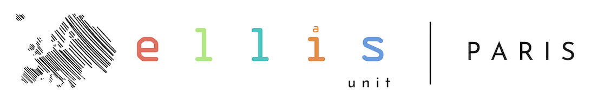
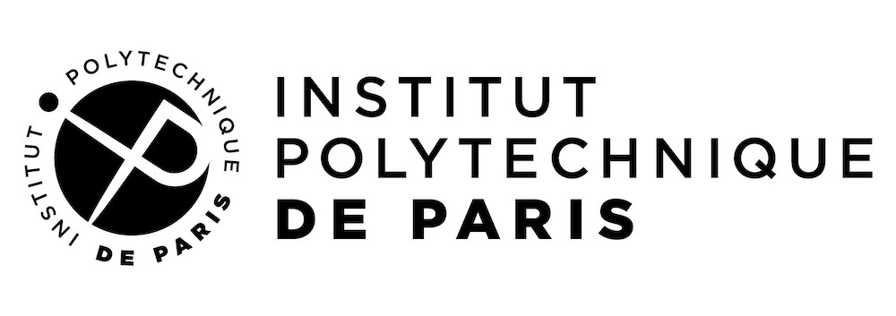
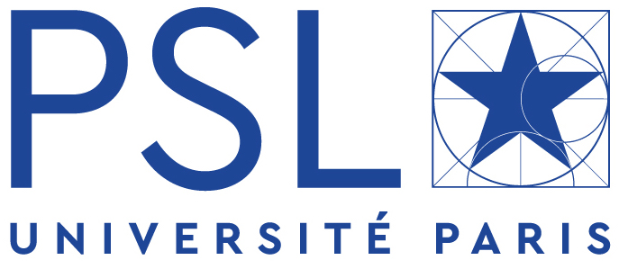
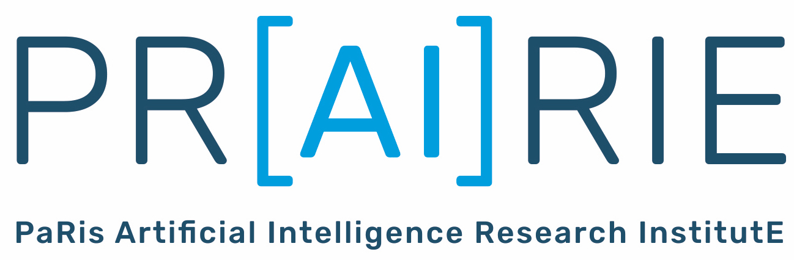

Welcome to the homepage of the Paris ELLIS Unit. [ELLIS](https://ellis.eu/) is the European Laboratory for Learning and Intelligent Systems. Its goal is to actively participate in the coordination of actions around artificial intelligence in the Paris region, in interaction with other members of the [ELLIS network](https://ellis.eu/).

Our vision
---

Our vision for this unit is to be as open as possible and to help researchers to create new exciting projects. This will include teaching programs, conferences, student funding and exchange. The Unit will favor interdisciplinary research and be as inclusive as possible, with a particular emphasis on diversity and gender equality. The artificial intelligence ecosystem in Paris is huge, and it integrates different institutions over a wide geographic area. The goal of our unit is not to create yet another institute, but to help researchers and students in these institutions to collaborate within the ELLIS network.

Joining the Unit
---

You can find in the [members section](members/) a list of local coordinators spread over the Paris area. You can contact your closest coordinator for more information to join the Unit. You [can contact us](mailto:gabriel.peyre@ens.fr) if you would like to become a local coordinator.

Mailing list
---

[You can register to our mailing list](https://docs.google.com/forms/d/e/1FAIpQLSdeZw4oH4GmuLKQ_4IlN3iCPAyeDrOM-9s1mdXvxahNorbUtw/viewform?usp=pp_url) to be informed about the events and projects developed by the unit.

Supporting institutions
---

 
&nbsp;&nbsp;&nbsp;&nbsp;&nbsp;
&nbsp;&nbsp;&nbsp;&nbsp;&nbsp;
 
&nbsp;&nbsp;&nbsp;&nbsp;&nbsp;
&nbsp;&nbsp;&nbsp;&nbsp;&nbsp;

Collaborating AI institutes
---

&nbsp;&nbsp;&nbsp;&nbsp;&nbsp;
&nbsp;&nbsp;&nbsp;&nbsp;&nbsp;

